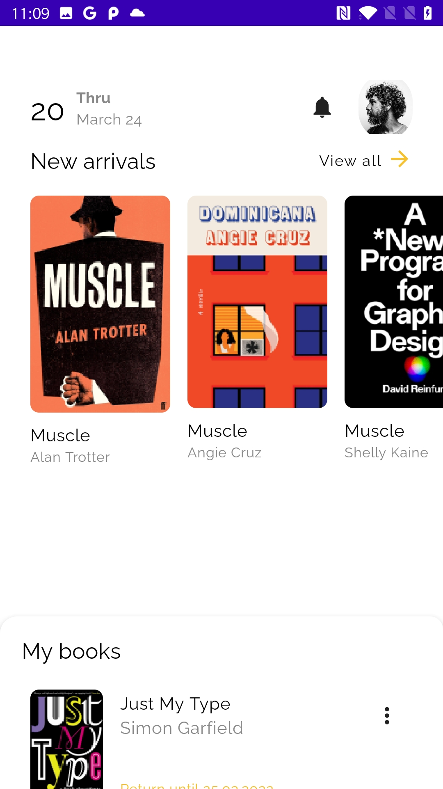
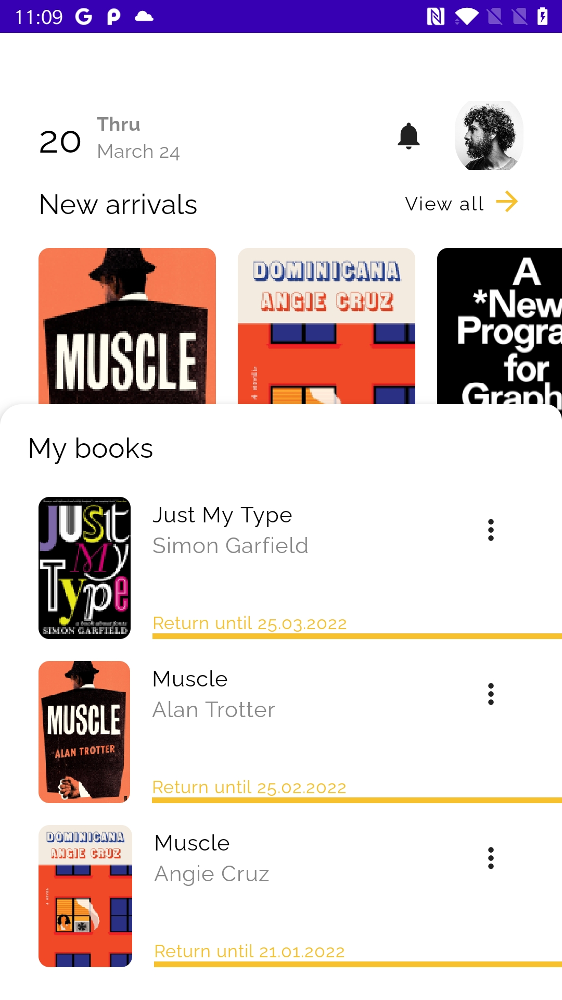

# Library App UI

This is s simple one screen UI application for a library app.

  
  

  
## Tech Stack

**Client:** Kotlin, Jetpack Compose

## Authors

- [@Osida](https://github.com/Osida)
- [@Coding Ark](https://www.youtube.com/channel/UCIdDFqXmAdXWbdpS9aHwLCg)
